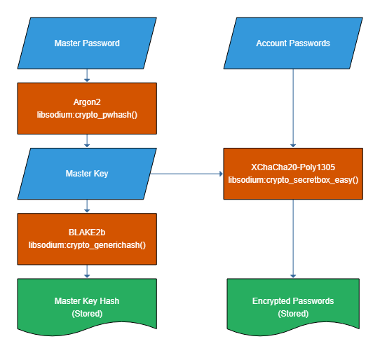

# Pidgin Master Password

This is a Pidgin plugin that stores account passwords encrypted by a master
password.

## Security Considerations
During login the account passwords must be sent to Pidgin/libpuple unencrypted.
From there a malicious third-party plugin can collect them **quite easily**.
This is a limitation of libpurple which all password manager and keyring
plugins suffer from.

## Encryption
- From the master password a master key is derived using the Argon2
  algorithm which is designed to be slow and memory-consuming in order to
  prevent brute-force attacks.
- This master key is used to encrypt the account passwords with
  XChaCha20-Poly1305. This algorithm is equally secure as AES256-GCM but
  [harder to mess up][1].
- To verify the master password a hash of the master key is stored.
- The master key is protected in memory as good as possible by using
  libsodium's allocation functions `sodium_malloc()` and `sodium_free()`.

All operations are done with high-level [libsodium][2] functions so that best
practices are in place and will be updated with the library.

[1]: https://libsodium.gitbook.io/doc/secret-key_cryptography/aead/aes-256-gcm
[2]: https://libsodium.gitbook.io/doc/
